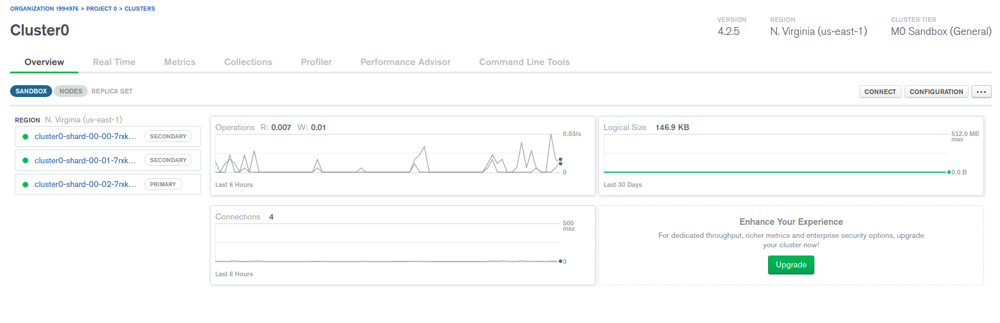
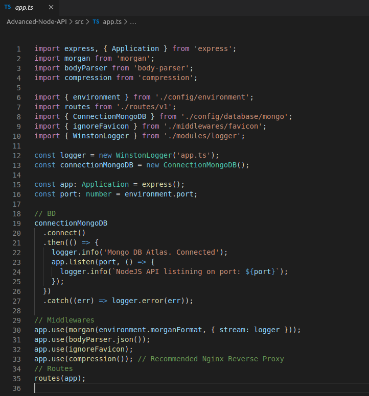
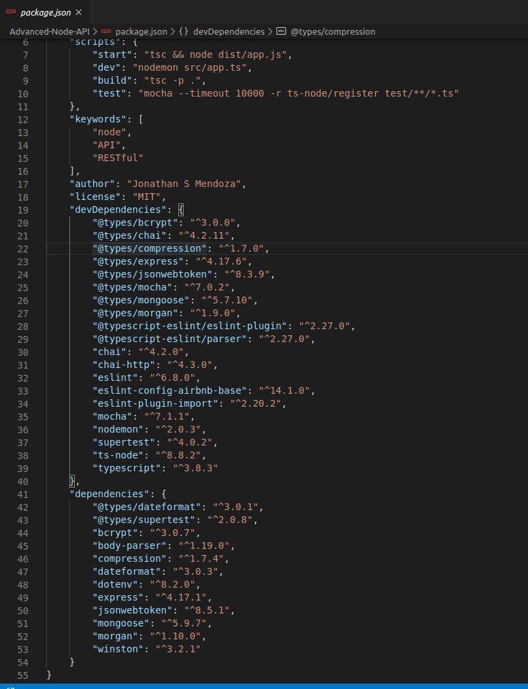
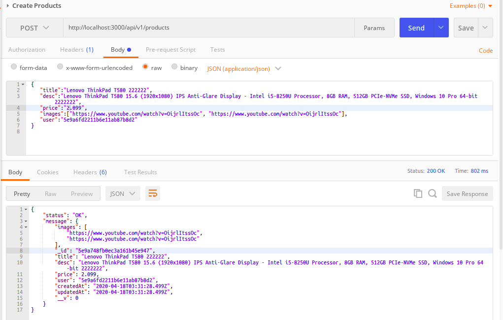
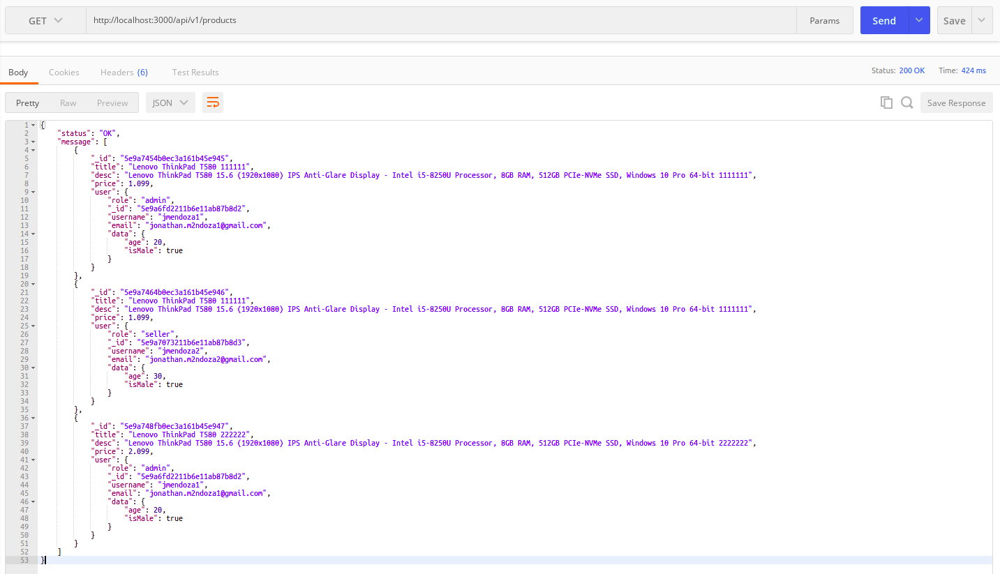

# Advanced-Node-API

Template for project structure with NodeJS (RESTful API), Mongo DB Atlas, JSON Web Token (JWT), TypeScript.
Handle errors. Environment variables for development and production. Logging library. Best Practices for Node.js Development.

### MongoDB Atlas

- Create DATABASE and COLLECTION
- Create Database User
- Add your IP Address (public) in IP Whitelist, Network Access

### Setup Application

File: .env

File: app.js

File: package.json

### Running Application with MongoDB Atlas

### Create User

### Generate JSON Web Token (JWT) to use API services

### Get Users

### Create Products

### Get Products

