# Basic API RESTful Develop with Node JS  - V1

Example of an basic API RESTful with Node JS and Mongo DB Atlas

### MongoDB Atlas

- Create DATABASE and COLLECTION
- Create Database User
- Add your IP Address (public) in IP Whitelist, Network Access

DATABASE

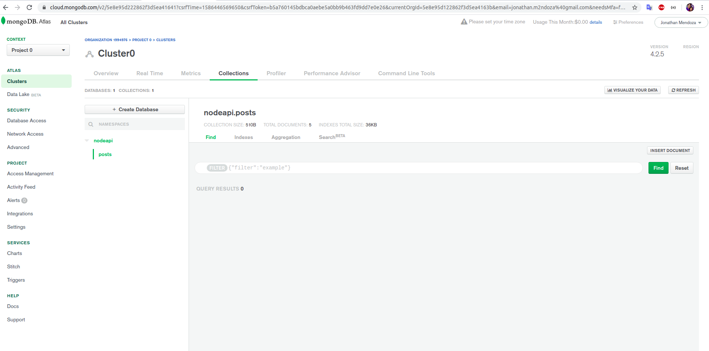

### Setup Application with MongoDB Atlas

File: .env

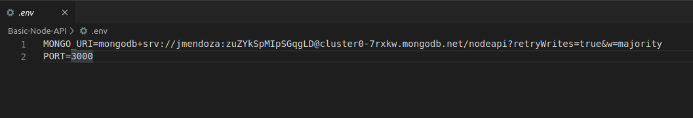

File: app.js

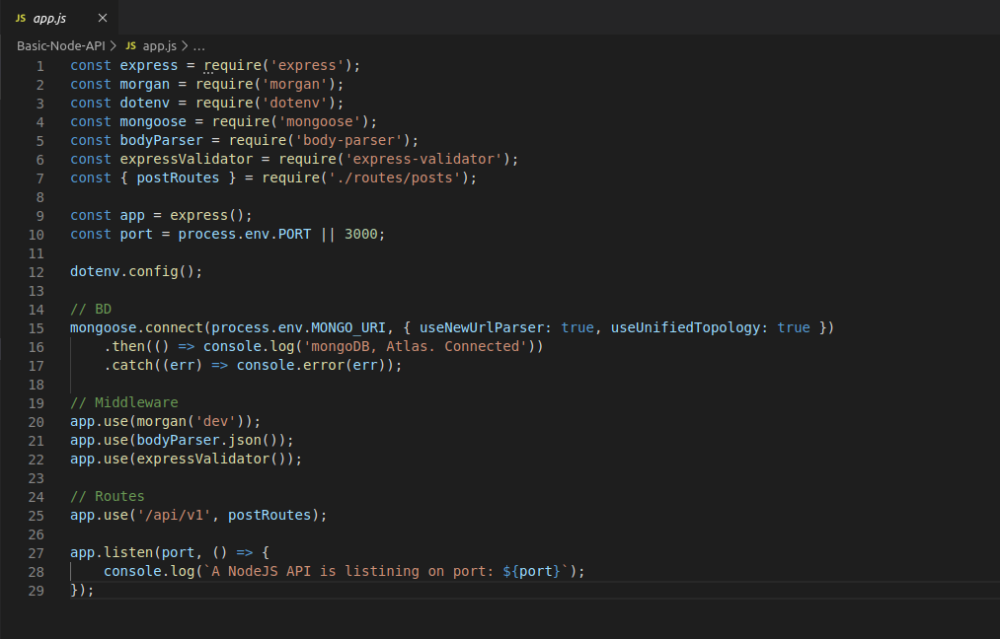

File: package.json

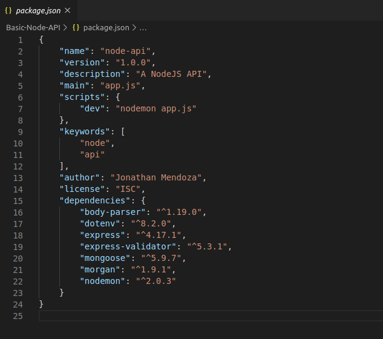

### Running Application with MongoDB Atlas

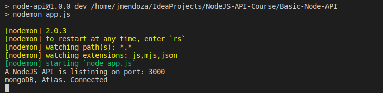

### Create documents

Postman

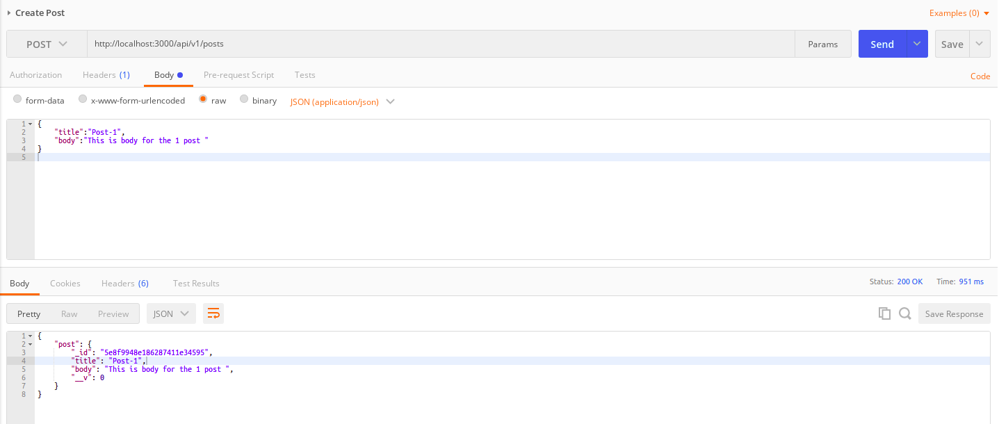

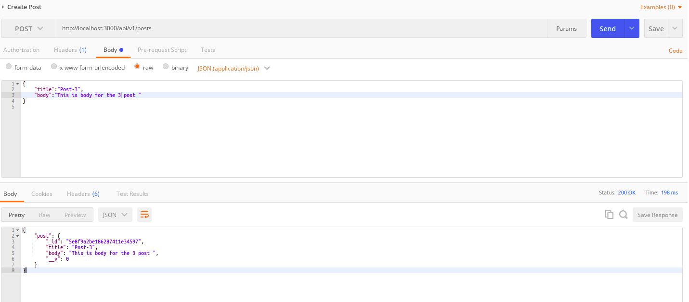

Console

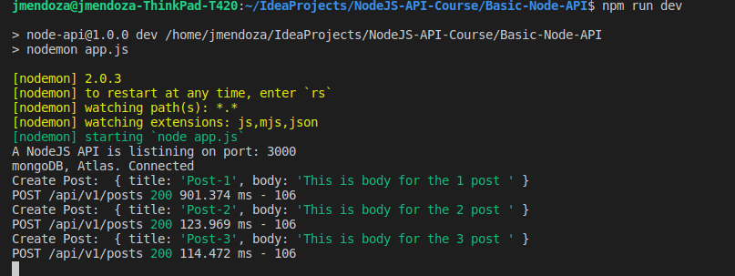

MongoDB Atlas

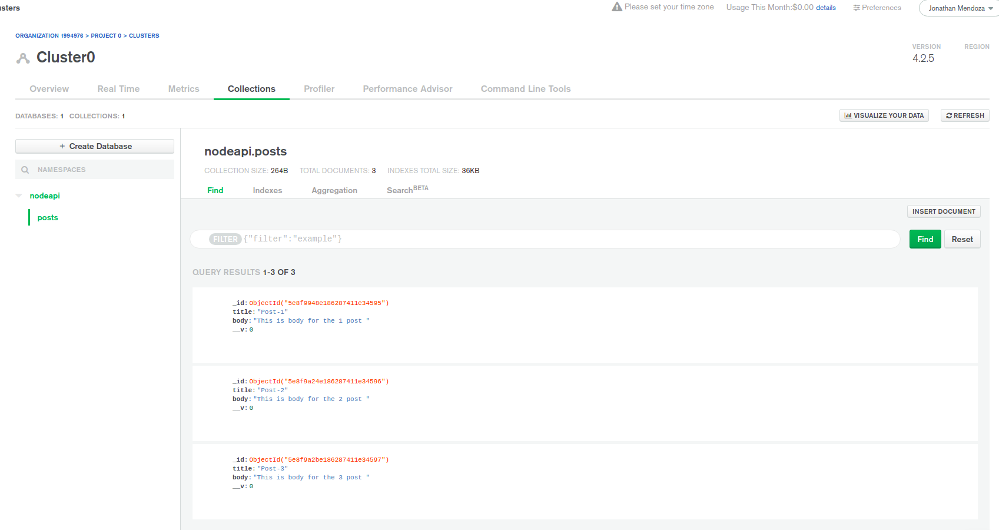

### Get documents

Postman

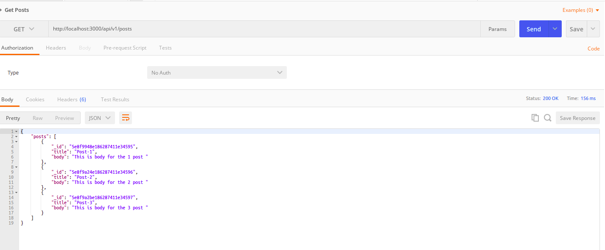

Console

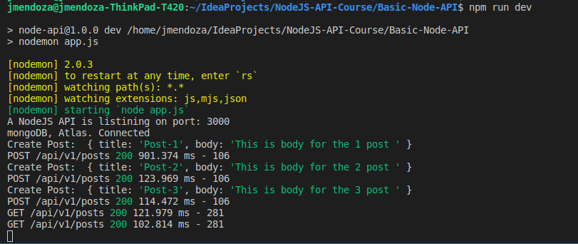

