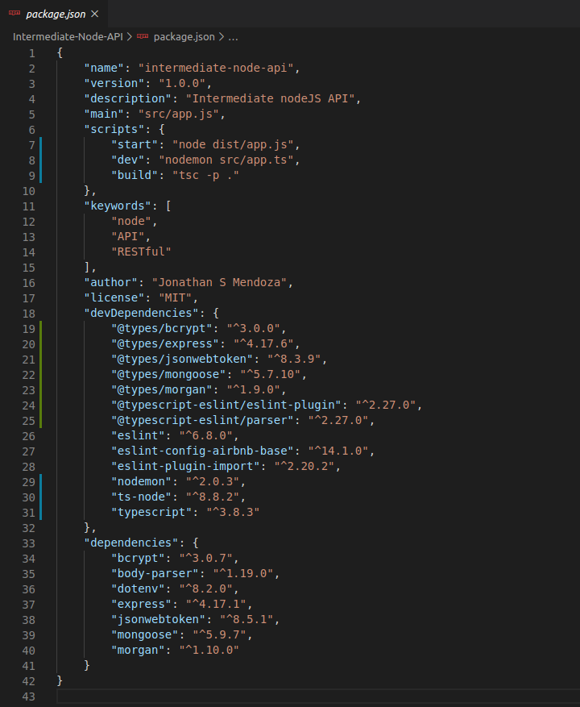

# Intermediate API RESTful Develop with Node JS - V1 (TypeScript)

Example of an basic API RESTful with Node JS and Mongo DB Atlas. 
Eslint and Prettier, CRUD operations, Project structure for an Express REST API (Model, Routes, Controllers, Services), 
Async Arrow Functions, Error Handling, Mongoose and Mongo DB Atlas, JSON Web Token (JWT), TypeScript

### MongoDB Atlas

- Create DATABASE and COLLECTION
- Create Database User
- Add your IP Address (public) in IP Whitelist, Network Access

DATABASE

### Setup Application

File: .env

File: app.js

File: package.json

### Running Application with MongoDB Atlas

### Create User

User with role "admin"

User with role "seller" by default

Console

MongoDB Atlas

### Generate JSON Web Token (JWT) to use API services

### Update User

### Get Users

Request with token expired

Request with new token 

### Create products for a user

MongoDB Atlas

### Get products for a user

