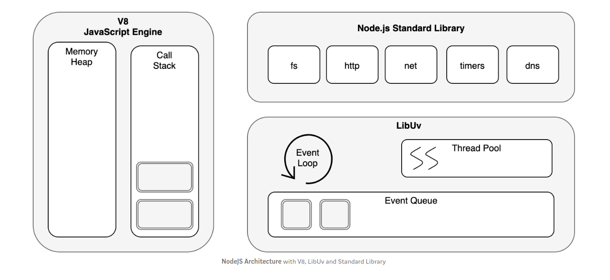

# NodeJS Architecture

The key to understanding NodeJS is: Node.js uses a non-blocking I/O model and asynchronous programming style.

### Asynchronous Non-Blocking I/O → Event Loop

Asynchronous Non-Blocking I/O → Event Loop
From above it can be seen that node.js is using async callback programming model for handling I/O operations to unblock single thread. Any external operations that might result in delays are attached with a callback function that is to be executed when slow operation is complete. These events executed parallel using Thread Pool, and callbacks are handled by Event Loop.

The event loop is what allows Node.js to perform non-blocking I/O operations — despite the fact that JavaScript is single-threaded — by offloading operations to the system kernel whenever possible.
This diagram shows major components interact to provide asynchronous I/O:

Thereby any slow I/O operations would not be blocking main thread, but rather passed to node.js to be executed in background. Hence main thread continues with its program in non-blocking nature. Once I/O operation is complete, its callback will be executed by main thread using Event Loop and Event Queue.

Reference: https://medium.com/@chathuranga94/nodejs-architecture-concurrency-model-f71da5f53d1d

# NodeJS-API-Course

Examples of API RESTful with Node JS and Mongo DB Atlas

### Basic-Node-JS
 
 Writing functions, Using arrow functions,  Programming for Event Loop, Asynchronous programming

### Basic-Node-API
Creating server with express, Routes, Controller, Model, Middleware, Mongo DB Atlas, Mongoose

### Intermediate-Node-API
Express, Eslint and Prettier, CRUD operations, Project structure for an Express REST API (Model, Routes, Controllers, Services), 
Async Arrow Functions, Error Handling, Mongoose and Mongo DB Atlas, JSON Web Token (JWT) 

### Intermediate-Node-API-TypeScript
Express, Eslint and Prettier, CRUD operations, Project structure for an Express REST API (Model, Routes, Controllers, Services), 
Async Arrow Functions, Error Handling, Mongoose and Mongo DB Atlas, JSON Web Token (JWT)

Migrating To TypeScript, Promises, Async Await, Pretty code.

### Advanced-Node-API
Template for project structure with NodeJS (RESTful API) and Express, Mongo DB Atlas, JSON Web Token (JWT), TypeScript. Handle errors. Environment variables for development and production. Logging library. Best Practices for Node.js Development